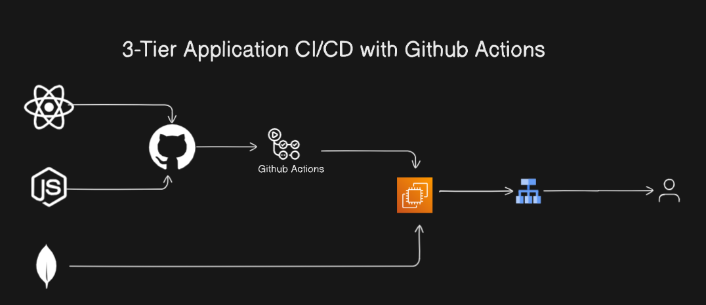

# MERN App Deployment on EC2 Using GitHub Actions and Load Balancer (ALB)

## Architecture Diagram

## Introduction
This project demonstrates how to set up Continuous Integration and Continuous Deployment (CI/CD) for a MERN (MongoDB, Express, React, Node.js) application using GitHub Actions. The application is deployed on an EC2 instance with traffic distributed using an Application Load Balancer (ALB). By the end of this guide, you'll have a robust deployment pipeline for your MERN app.

---

## Features
- **Automated CI/CD Pipeline**: Leverage GitHub Actions to build, test, and deploy your application seamlessly.
- **Scalable Deployment**: Use AWS EC2 and ALB to handle high traffic with ease.
- **Full-Stack Setup**: Complete configuration for MongoDB, Express, React, and Node.js.

---

## Prerequisites
- **AWS Account**: Set up EC2 and ALB resources.
- **GitHub Repository**: Host your MERN app code.
- **Domain Name**: (Optional) for routing through the ALB.

---

## Architecture
1. **Frontend**: React.js for the user interface.
2. **Backend**: Node.js with Express.js for server-side logic.
3. **Database**: MongoDB for data persistence.
4. **CI/CD Pipeline**: GitHub Actions for automation.
5. **Infrastructure**: AWS EC2 instance and Application Load Balancer for scalable hosting.

---

## CI/CD Pipeline with GitHub Actions
### Workflow Steps:
1. **Code Checkout**: Pull the latest code from the GitHub repository.
2. **Build Step**:
   - Install dependencies using `npm install`.
   - Build the React frontend.
   - Package the Node.js backend.
3. **Testing**:
   - Run unit tests and integration tests.
4. **Deployment**:
   - SSH into the EC2 instance.
   - Deploy the application using custom deployment scripts.
   - Restart services (if required).

 
## How to Star the Repository
If you find this project helpful, please give it a star! ⭐

---

## Author
**Jibran**  
Connect with me on [LinkedIn](https://www.linkedin.com/in/muhammad-jibran220/).

---
 